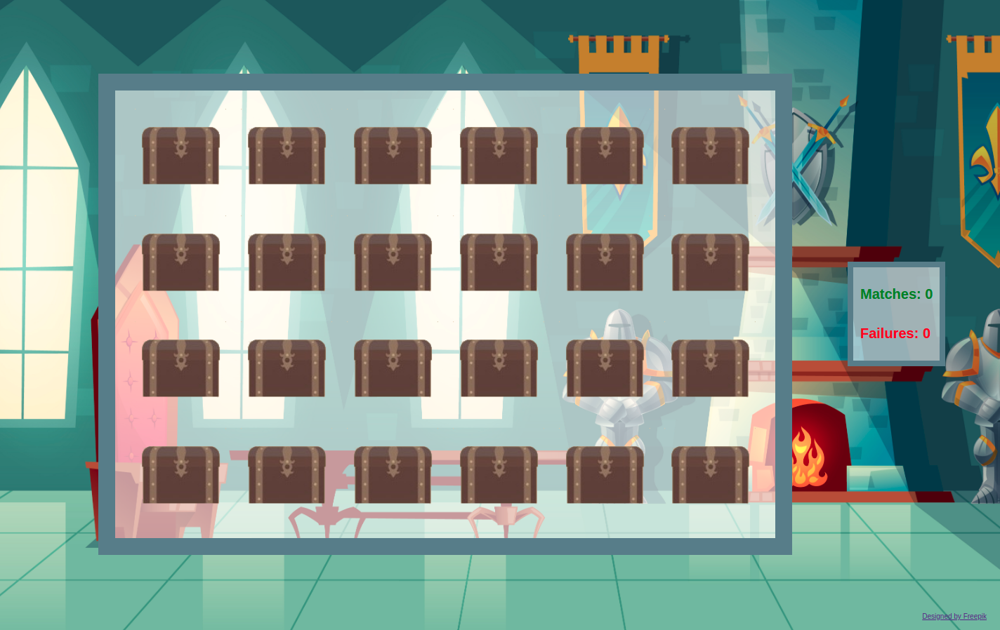

## FAIRYTALE MATCHING GAME

<p align="center">
  
</p>

Fairytale matching game is a traditional memory game. To win, you need to remember the position of every card and match with it pair.

### **Features**

- When the game starts, 24 closed coffers appear.
- Inside every coffers there are the fairytale characters hidden.
- The player has to open two coffers searching a pair.
- If the characters are different, the coffers will appear, hidden the cards.
- The user has to remember the position of every character and try to make pairs with the cards.
- When a pair is found, it will remain visible.
- The counter informs about the number of matching and failures.
- When the user has matched all pairs, a resume will appear with the final score.

### **Setup**
---
If you’d like to view my project in your browser:

- Clone the repository in your computer, you can type the following command in your terminal
```bash
git clone https://github.com/diana-moreno/fairytale-matching-game.git
```
- Open fairytale-matching-game's folder.
- Open index.html
- Otherside, you can run the project here: https://diana-moreno.github.io/fairytale-matching-game/


### **What I learned**

- Acces and manipulate the DOM with jQuery to select and trigger changes in the page.
- Add effects with jQuery.
- Achieve graphical behaviour throughout async and callback functions.
- Dynamically change the look of an HTML element.
- Utilize  properly CSS Grid and Flex.
- Understand the logic behind.
- Split code in different files to be more organized.


### **Resources**

- Designed by [freepik](www.freepik.com).
